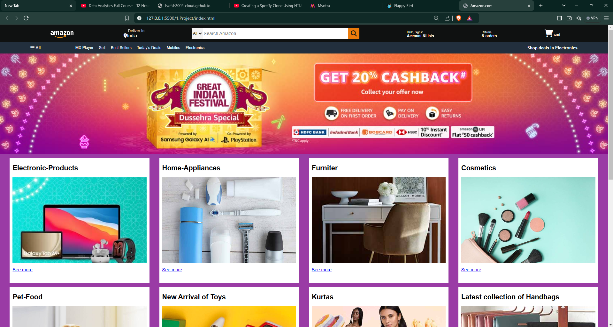

# projects
my projects(html,Css,javascript)
 
Aurthor-Harish.E
 
<h3>1.Amazon-Clone</h3>

 Languages used
  <li>Html</li>
  <li>Css</li>
   
  

 
<h3>2.Myntra</h3>

 Languages used
<li>Html</li>
<li>Css</li>
 

<h3>3.Flappy-Bird</h3>

 Languages used
<li>Html</li>
<li>Css</li>
<li>Java Script</li>

  

